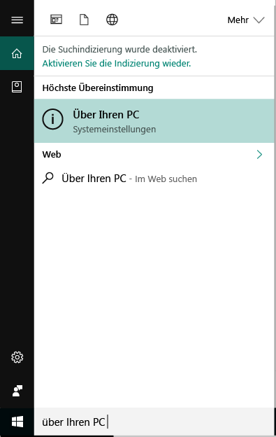
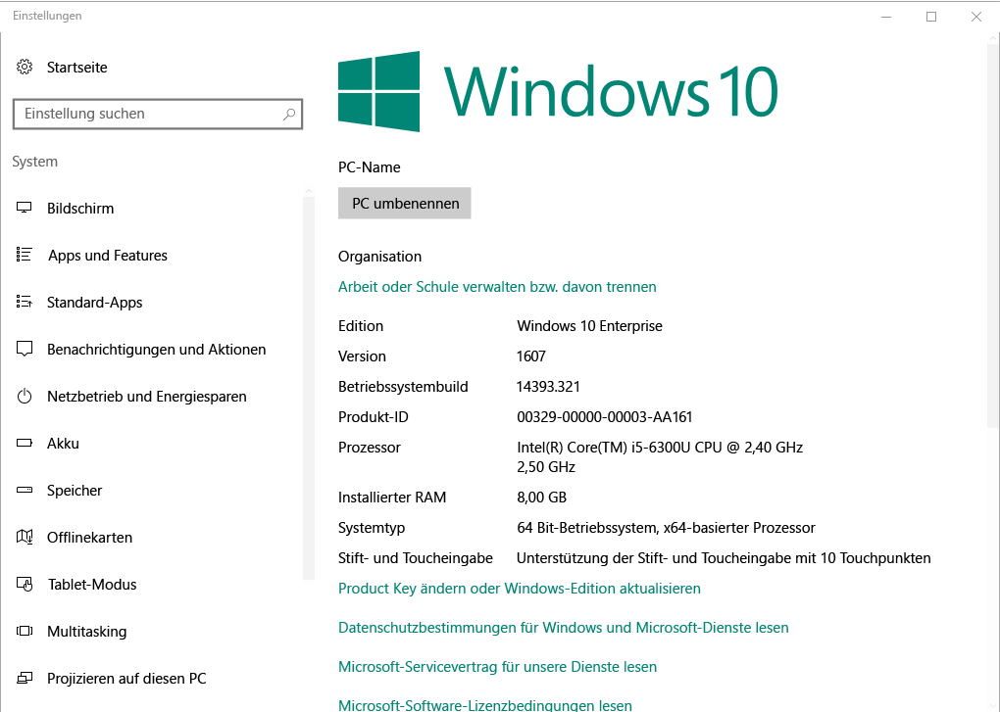

# Registrieren Ihrer Windows 10-Geräte bei Intune

Wenn Sie Ihre Geräte bei Microsoft Intune registrieren, können Ihre Windows 10-Geräte Zugriff auf die sicheren Daten Ihres Unternehmens wie E-Mails, Dateien und andere Ressourcen erhalten. Dies gilt für Windows 10 Desktop- und Windows 10 Mobile-Geräte. Durch die Registrierung Ihrer Geräte können Sie diesen Zugriff sowohl für sich selbst als auch für Ihr Unternehmen sichern und Ihre Arbeitsdaten von Ihren persönlichen Daten getrennt halten.

Möchten Sie mehr erfahren? Erfahren Sie, was geschieht, wenn Sie [Ihr Gerät bei Intune registrieren](what-happens-if-you-install-the-company-portal-app-and-enroll-your-device-in-intune-windows.md), und was das für die [Informationen auf Ihrem Gerät](what-info-can-your-company-see-when-you-enroll-your-device-in-intune.md) bedeutet.

## Windows 10 Desktop-Geräte

1. Öffnen Sie das **Startmenü**.

2. Geben Sie den Ausdruck „PC-Infos“ in der __Suchleiste__ ein, und wählen Sie dann __PC-Infos__ aus.

 

3.  In Ihren __Einstellungen__ sehen Sie eine Liste mit Informationen über die Windows 10-Version auf Ihrem PC. Suchen Sie in der Liste nach der __Version__.

 

4.  Wenn Ihre Version __1607 oder höher__ lautet, fahren Sie [folgendermaßen](enroll-your-w10-device-access-work-or-school.md) fort. Wenn Ihre Version __1511 oder älter__ lautet, fahren Sie [folgendermaßen](enroll-your-w10-device-your-account.md) fort.

## Windows 10 Mobile-Geräte        

1.  Navigieren Sie unter __Start__ zur Liste __Alle Apps__, und wählen Sie anschließend die App __Einstellungen__ aus.        
2.  Tippen Sie auf __System__, anschließend auf __About__ (Informationen).       
3.  Unter __Geräteinformationen__, tippen Sie auf __Details__. Sie sehen eine Liste mit Informationen zu Ihrem Gerät. Suchen Sie in der Liste nach der __Version__.        
4.  Wenn Ihre Version __1607__ lautet, fahren Sie [folgendermaßen](enroll-your-w10-device-access-work-or-school.md) fort. Wenn Ihre Version __1511 oder älter__ lautet, fahren Sie [folgendermaßen](enroll-your-w10-device-your-account.md) fort.

Benötigen Sie weitere Unterstützung? Wenden Sie sich an Ihren IT-Administrator. Die entsprechenden Kontaktinformationen finden Sie auf der [Unternehmensportal-Website](http://portal.manage.microsoft.com).
