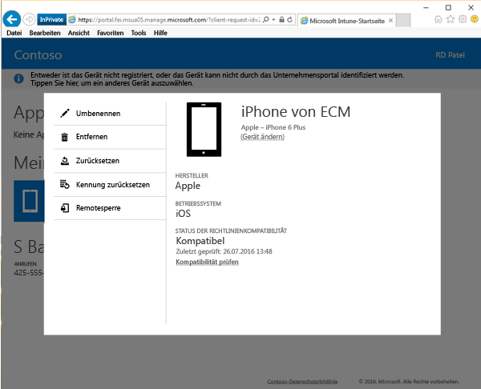

# Sperren Ihres Geräts remote über die Unternehmensportalwebsite

Unfälle passieren, und manchmal kann ein Gerät verloren gehen. Wenn Sie Ihr Gerät verloren haben oder es gestohlen wurde, machen Sie sich womöglich zuerst Sorgen darüber, dass jeder nun Zugriff auf die Informationen auf dem Gerät hat, egal wo sich dieses befindet.

[!INCLUDE[wit_nextref](includes/end-user-password-guidance.md)]

Um sicherzugehen, können Sie es mithilfe der Remotesperrfunktion auf der [Unternehmensportalwebsite](https://portal.manage.microsoft.com) sperren. Die Remotesperre funktioniert für:

* Android
* iOS
* macOS
* Windows 10 Mobile (wenn für das Gerät bereits eine Kennung festgelegt wurde)
* Windows Phone 8.1 (wenn für das Gerät bereits eine Kennung festgelegt wurde)

## So verwenden Sie die Remotesperre zum Sperren Ihres Geräts

1.  Tippen Sie auf der [Unternehmensportalwebsite](https://portal.manage.microsoft.com) auf die Schaltfläche __Menü__ , und wählen Sie dann __Meine Geräte__ aus.

  

2. Wählen Sie auf der Seite __Meine Geräte__ den Namen des Geräts aus, das Sie sperren möchten.

  

3.  Das Gerät wird in einem Popupfenster geöffnet. Tippen Sie auf die Schaltfläche **Remotesperre**.

    

4.  Eine Benachrichtigung wird angezeigt, damit Sie wissen, dass Sie gerade Ihr Gerät sperren. Tippen Sie auf **Remotesperre**, und die Unternehmensportal-Website versucht, das Gerät zu sperren.

    Nachdem Sie **Remotesperre** ausgewählt haben, wird die Meldung „Remotesperre steht aus“ angezeigt.  Wenn die Remotesperre erfolgreich durchgeführt wurde, ändert sich der Status zu „Remotesperre war erfolgreich“.

    Der Status „Remotesperre“ wird an drei Stellen angezeigt:

    * Im Benachrichtigungsbereich der Website.
    * Die **Detailseite** für das Gerät.
    * Die Kachel zeigt den Gerätenamen im Bereich **My Devices** (Meine Geräte) auf der Seite.

> [!Note]
> Wenn eine Meldung „Fehler bei der Remotesperre“ angezeigt wird, warten Sie einige Minuten, und versuchen Sie erneut, das Gerät zu sperren. Sobald Sie die Option zum erneuten Versuchen auswählen, ändert sich der Status wieder zu „Remotesperre steht aus“. Wenn der erneute Versuch nicht funktioniert, wenden Sie sich bitte an den Support Ihres Unternehmens.

Wenn Sie Ihr Gerät wiederfinden und die Remotesperre aufheben möchten, geben Sie einfach Ihre Kennung ein.

Benötigen Sie weitere Unterstützung? Kontaktieren Sie den Support Ihres Unternehmens. Die entsprechenden Kontaktinformationen finden Sie auf der [Unternehmensportal-Website](https://portal.manage.microsoft.com).
