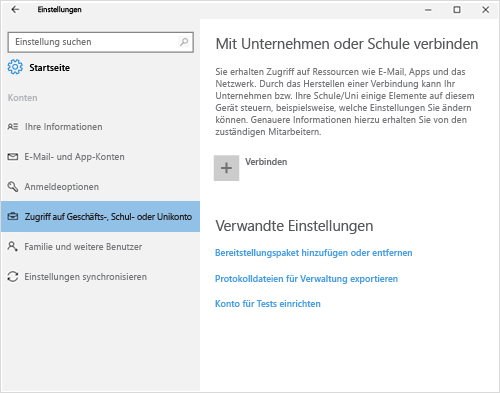
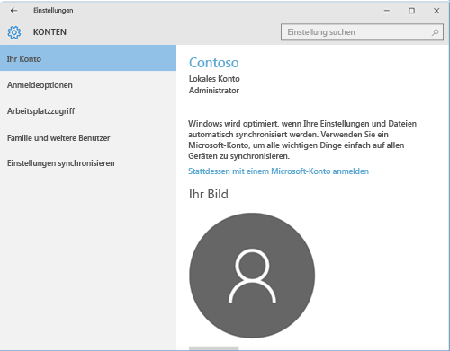
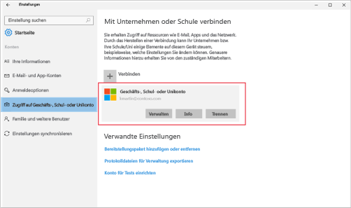

# Behandlung von Problemen bei der Registrierung von Windows 10-Geräten
Wenn Sie die Schritte unter [Registrieren Ihres Windows 10 Mobile- oder Windows 10-Desktopgeräts bei Intune](enroll-your-w10-phone-or-w10-pc-windows.md) befolgt haben, aber dennoch nicht auf E-Mails und Dateien Ihres Geschäfts-, Schul- oder Unikontos zugreifen können, führen Sie zur Problembehandlung die folgenden Schritte durch.

1.  Sehen Sie sich die beiden folgenden Bildschirme an, und suchen Sie denjenigen heraus, der der Anzeige auf Ihrem Gerät entspricht. Befolgen Sie die Schritte, die zu diesem Bildschirm gehören.

    Wenn dieser Bildschirm angezeigt wird, befolgen Sie die Schritte unter [Schritte zur Problembehandlung bei Anzeige von „Zugriff auf Geschäfts-, Schul- oder Unikonto“](#troubleshooting-steps-to-follow-if-you-see-access-work-or-school).

    

    Wenn dieser Bildschirm angezeigt wird, befolgen Sie die Schritte unter [Schritte zur Problembehandlung bei Anzeige von „Ihr Konto“](#troubleshooting-steps-to-follow-if-you-see-your-account).

    

## Schritte zur Problembehandlung bei Anzeige von „Zugriff auf Geschäfts-, Schul- oder Unikonto“

1.  Wenn Sie die obigen Schritte ausgeführt haben und trotzdem nicht auf E-Mails und Dateien Ihres Geschäfts-, Schul- oder Unikontos zugreifen können, wechseln Sie zurück zu **Zugriff auf Geschäfts-, Schul- oder Unikonto**.

2. Führen Sie eines der folgenden Verfahren aus:

    - Wenn eine Verbindung ähnlich der unten gezeigten Abbildung angezeigt wird, tippen sie darauf, und überprüfen Sie, ob die Optionen „Verwalten“, „Info“ und „Trennen“ angezeigt werden. Wenn das der Fall ist, sind Sie jetzt registriert und verbunden.

    

    - Wenn die oben gezeigten Verbindungsinformationen nicht angezeigt werden oder einige Optionen fehlen, tippen Sie auf **Verbinden**, und melden Sie sich mit den Anmeldeinformationen für Ihr Geschäfts-, Schul- oder Unikonto an. Jetzt sollte eine Verbindung hergestellt sein.

## Schritte zur Problembehandlung bei Anzeige von „Mein Konto“

Wenn Sie die obigen Schritte ausgeführt haben und trotzdem nicht auf E-Mails, Dateien und andere Daten Ihres Geschäfts-, Schul- oder Unikontos zugreifen können, wechseln Sie zurück zu **Konten**, und tippen Sie auf **Geschäftszugriff**.

- Wenn Ihr Geschäfts- oder Schulkonto angezeigt wird, sind keine weiteren Schritte erforderlich. Sie sind verbunden.

- Wenn Ihr Geschäfts- oder Schulkonto nicht angezeigt wird, tippen Sie auf **Verbinden**, und melden Sie sich mit den Anmeldeinformationen Ihres Geschäfts- oder Schulkontos an.

## Schritte zur Problembehandlung bei Anzeige von „Geschäfts-, Schul- oder Unikonto einrichten“

Wenn eine Meldung angezeigt wird, die __We couldn't auto-discover a management endpoint matching the username entered. Please check your username and try again. If you know the URL to your management endpoint, please enter it.__ (Es konnte automatisch kein Verwaltungsendpunkt erkannt werden, der mit dem eingegebenen Benutzernamen übereinstimmt. Bitte überprüfen Sie Ihren Benutzernamen, und versuchen Sie es noch einmal. Wenn Sie die URL zu Ihrem Verwaltungsendpunkt kennen, geben Sie sie ein.) angibt, versuchen Sie, Ihren Benutzernamen und das Kennwort erneut anzugeben. Wenn es immer noch nicht funktioniert, wenden Sie sich für die Website, die Sie im Textfeld **Verwaltungsendpunkt** bereitstellen müssen, an den Support Ihres Unternehmens. Dies ist eine Website, die in etwas so aussieht: **www.ihrefirma.aufmicrosoft.com**.

Benötigen Sie weitere Unterstützung? Kontaktieren Sie den Support Ihres Unternehmens. Die entsprechenden Kontaktinformationen finden Sie auf der [Unternehmensportal-Website](https://portal.manage.microsoft.com).
